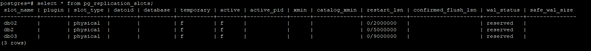

## Replication - Dump ve Restore İşlemleri
**Version 1.0.0**

## Ön gereksinimler
    #Postgres
    #Virtualbox

## Postgres veritabanında replication,dump ve restore işlemlerini içerir.
 

**1.0 Replication**
### Master

`$ vim pg_hba.conf` Kuralların ekleneceği konfigürasyon dosyası açılır. Slave bu konfigürasyon dosyasında aşağıdaki şekilde tanımlanır.  

    #host replication standby 192.168.56.102/32 "scram-sha-256"

`$ select pg_reload_conf();` Değişiklikler için reload işlemi uygulanır.

`$ create role standby login replication password 'Pj0zl9pXprWrYbQnQ4x6';` Role tanımı yapılır.

`$ vim ~/.pgpass` pgpass dosyası oluştururlur ve aşağıdaki şekilde slave için ekleme yapılır.

    #192.168.56.102:5432:replication:standby:'Pj0zl9pXprWrYbQnQ4x6';

`$ chmod 600 ~/.pgpass` Dosyanın yetkileri düzenlenir.

### Slave

`$ vim ~/.pgpass;` pgpass dosyası oluştururlur ve aşağıdaki şekilde master için ekleme yapılır.

    #192.168.56.101:5432:replication:standby:'Pj0zl9pXprWrYbQnQ4x6';

`$ chmod 600 ~/.pgpass` Dosyanın yetkileri düzenlenir ve aşağıdaki komut çalıştırılarak replication oluşturulmuş olur.

    pg_basebackup \
    --pgdata=/pg_data/13/main \
    --write-recovery-conf \ 
    --checkpoint=fast \
    --create-slot \ 
    --slot=db03 \
    --wal-method=stream \
    --verbose \
    --progress \
    --dbname="host=192.168.56.101 user=standby sslmode=disable"
 

   
**2.0 Dump**

`$ pg_dump -Fc -h 127.0.0.1 -U fethi trendyol -f trendyol.dump` pg_dump komutu çalıştırılarak trendyol veritabanını için aynı dizinde trendyol.dump oluşturulur.

**3.0 Restore**

`$ create database trendyol_dump` trendyol_dump adında bir veritabanı oluşturulur.  
`$ pg_restore -d trendyol_dump -h 127.0.0.1 -U fethi trendyol.dump` pg_restore komutu kullanılarak yeni oluşturulan veritabanına restore işlemi gerçekleştirilir.
